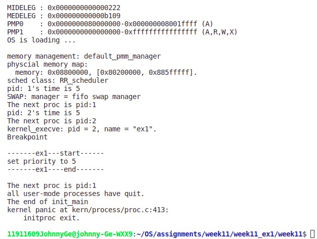
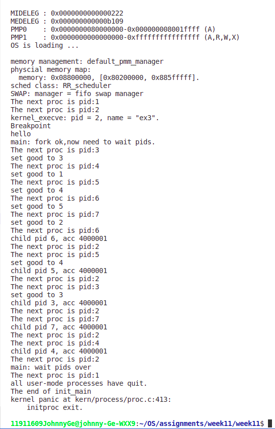

# Assignment11-Report

* ### 11911609 葛兆宁

## EX0

| Time | HRRN | FIFO/FCFS | RR | SJF | Priority |
| ---- | ---- | ---- | ---- | ---- | ---- |
|1|A|A|A|A|A|
|2|A|A|A|A|B|
|3|A|A|B|A|A|
|4|A|A|A|A|D|
|5|B|B|D|B|D|
|6|D|D|A|D|C|
|7|D|D|C|D|C|
|8|C|C|D|C|C|
|9|C|C|C|C|A|
|10|C|C|C|C|A|
|Average Turn-around Time|4.5|4.5|4.75|4.5|4.25|

## EX1

(1) design ideas

* From my view, this can be solved by creating a new syscall.

(2) modified code:

* proc.c: change user_main to ex1

* user/ulib.h(add code):

```ulib.h
int set_priority(int prior);
```

* user/ulib.c(add code):

```ulib.c
int set_priority(int prior)
{
    return sys_setpriority(prior);
}
```

* user/syscall.h(add code):

```1_sys_u.h
int sys_setpriority(int prior);
```

* user/syscall.c(add code):

```1_sys_u.c
int sys_setpriority(int prior)
{
    return syscall(SYS_labschedule_set_priority,prior);
}
```

* kernel/syscall.c:

```1_sys_k.c:
static int sys_setprior(uint64_t arg[])
{
    int prior=(int)arg[0];
    // labschedule_set_priority( prior);
    current->labschedule_priority=prior;
    cprintf("set priority to %d\n",prior);
}


static int (*syscalls[])(uint64_t arg[]) = {
    [SYS_exit] sys_exit,
    [SYS_fork] sys_fork,
    [SYS_wait] sys_wait,
    [SYS_exec] sys_exec,
    [SYS_yield] sys_yield,
    [SYS_kill] sys_kill,
    [SYS_getpid] sys_getpid,
    [SYS_putc] sys_putc,
    [SYS_gettime] sys_gettime,
    [SYS_labschedule_set_priority] sys_setprior,
    };

```

(3)result:

## EX2

(1) design ideas:  
this can be solved by change enqueue function.

(2) modified code:  

* proc.c: change user_main to ex2

* default_sched.c:

```df
static void
RR_enqueue(struct run_queue *rq, struct proc_struct *proc)
{

    list_add_before(&(rq->run_list), &(proc->run_link));
    if (proc->time_slice == 0 || proc->time_slice > rq->max_time_slice * proc->labschedule_priority)
    {
        proc->time_slice = rq->max_time_slice * proc->labschedule_priority;
        cprintf("pid: %d's time is %d\n",proc->pid,proc->time_slice);
    }
    proc->rq = rq;
    rq->proc_num++;
}
```

(3) result:

```ex3_result
11911609JohnnyGe@johnny-Ge-WXX9:~/OS/assignments/week11/week11_ex2/week11$ make qemu
+ cc kern/init/entry.S
+ cc kern/init/init.c
+ cc kern/libs/stdio.c
+ cc kern/libs/readline.c
+ cc kern/debug/panic.c
+ cc kern/debug/kdebug.c
+ cc kern/debug/kmonitor.c
+ cc kern/driver/ide.c
+ cc kern/driver/clock.c
+ cc kern/driver/console.c
+ cc kern/driver/intr.c
+ cc kern/trap/trap.c
+ cc kern/trap/trapentry.S
+ cc kern/mm/vmm.c
+ cc kern/mm/swap.c
+ cc kern/mm/kmalloc.c
kern/mm/kmalloc.c: In function '__slob_free_pages':
kern/mm/kmalloc.c:93:23: warning: passing argument 1 of 'kva2page' makes pointer from integer without a cast [-Wint-conversion]
   93 |   free_pages(kva2page(kva), 1 << order);
      |                       ^~~
      |                       |
      |                       long unsigned int
In file included from kern/mm/kmalloc.c:7:
kern/mm/pmm.h:109:16: note: expected 'void *' but argument is of type 'long unsigned int'
  109 | kva2page(void *kva) {
      |          ~~~~~~^~~
+ cc kern/mm/swap_fifo.c
+ cc kern/mm/default_pmm.c
+ cc kern/mm/pmm.c
+ cc kern/fs/swapfs.c
+ cc kern/process/switch.S
+ cc kern/process/entry.S
+ cc kern/process/proc.c
In file included from kern/process/proc.c:5:
kern/process/proc.c: In function 'do_execve':
kern/mm/pmm.h:87:17: warning: 'page' may be used uninitialized in this function [-Wmaybe-uninitialized]
   87 |     return page - pages + nbase;
      |                 ^
kern/process/proc.c:478:18: note: 'page' was declared here
  478 |     struct Page *page;
      |                  ^~~~
+ cc kern/schedule/sched.c
+ cc kern/schedule/default_sched.c
kern/schedule/default_sched.c: In function 'RR_enqueue':
kern/schedule/default_sched.c:22:9: warning: implicit declaration of function 'cprintf' [-Wimplicit-function-declaration]
   22 |         cprintf("pid: %d's time is %d\n",proc->pid,proc->time_slice);
      |         ^~~~~~~
+ cc kern/syscall/syscall.c
kern/syscall/syscall.c: In function 'sys_setprior':
kern/syscall/syscall.c:67:1: warning: no return statement in function returning non-void [-Wreturn-type]
   67 | }
      | ^
+ cc libs/string.c
+ cc libs/printfmt.c
+ cc libs/hash.c
+ cc libs/rand.c
+ cc user/hello.c
+ cc user/libs/panic.c
+ cc user/libs/syscall.c
+ cc user/libs/ulib.c
user/libs/ulib.c: In function 'set_priority':
user/libs/ulib.c:51:12: warning: implicit declaration of function 'sys_setpriority'; did you mean 'set_priority'? [-Wimplicit-function-declaration]
   51 |     return sys_setpriority(prior);
      |            ^~~~~~~~~~~~~~~
      |            set_priority
+ cc user/libs/initcode.S
+ cc user/libs/stdio.c
+ cc user/libs/umain.c
+ cc user/ex1.c
+ cc user/ex2.c
+ cc user/rr.c
+ cc user/forktest.c
+ cc user/ex3.c
+ ld bin/kernel
riscv64-unknown-elf-objcopy bin/kernel --strip-all -O binary bin/ucore.bin

OpenSBI v0.6
   ____                    _____ ____ _____
  / __ \                  / ____|  _ \_   _|
 | |  | |_ __   ___ _ __ | (___ | |_) || |
 | |  | | '_ \ / _ \ '_ \ \___ \|  _ < | |
 | |__| | |_) |  __/ | | |____) | |_) || |_
  \____/| .__/ \___|_| |_|_____/|____/_____|
        | |
        |_|

Platform Name          : QEMU Virt Machine
Platform HART Features : RV64ACDFIMSU
Platform Max HARTs     : 8
Current Hart           : 0
Firmware Base          : 0x80000000
Firmware Size          : 120 KB
Runtime SBI Version    : 0.2

MIDELEG : 0x0000000000000222
MEDELEG : 0x000000000000b109
PMP0    : 0x0000000080000000-0x000000008001ffff (A)
PMP1    : 0x0000000000000000-0xffffffffffffffff (A,R,W,X)
OS is loading ...

memory management: default_pmm_manager
physcial memory map:
  memory: 0x08800000, [0x80200000, 0x885fffff].
sched class: RR_scheduler
pid: 1's time is 5
SWAP: manager = fifo swap manager
setup timer interrupts
The next proc is pid:1
pid: 2's time is 5
The next proc is pid:2
kernel_execve: pid = 2, name = "ex2".
Breakpoint
pid: 3's time is 5
pid: 4's time is 5
pid: 5's time is 5
pid: 6's time is 5
pid: 7's time is 5
main: fork ok,now need to wait pids.
The next proc is pid:3
set priority to 3
pid: 3's time is 15
The next proc is pid:4
set priority to 1
pid: 4's time is 5
The next proc is pid:5
set priority to 4
pid: 5's time is 20
The next proc is pid:6
set priority to 5
pid: 6's time is 25
The next proc is pid:7
set priority to 2
pid: 7's time is 10
The next proc is pid:3
pid: 3's time is 15
The next proc is pid:4
pid: 4's time is 5
The next proc is pid:5
pid: 5's time is 20
The next proc is pid:6
pid: 6's time is 25
The next proc is pid:7
pid: 7's time is 10
The next proc is pid:3
pid: 3's time is 15
The next proc is pid:4
pid: 4's time is 5
The next proc is pid:5
pid: 5's time is 20
The next proc is pid:6
pid: 6's time is 25
The next proc is pid:7
pid: 7's time is 10
The next proc is pid:3
pid: 3's time is 15
The next proc is pid:4
pid: 4's time is 5
The next proc is pid:5
pid: 5's time is 20
The next proc is pid:6
pid: 6's time is 25
The next proc is pid:7
pid: 7's time is 10
The next proc is pid:3
pid: 3's time is 15
The next proc is pid:4
pid: 4's time is 5
The next proc is pid:5
pid: 5's time is 20
The next proc is pid:6
child pid 6, acc 4000001, time 3100
The next proc is pid:7
pid: 7's time is 10
The next proc is pid:3
pid: 3's time is 15
The next proc is pid:4
pid: 4's time is 5
The next proc is pid:5
child pid 5, acc 4000001, time 3570
The next proc is pid:2
The next proc is pid:7
pid: 7's time is 10
The next proc is pid:3
pid: 3's time is 15
The next proc is pid:4
pid: 4's time is 5
The next proc is pid:7
pid: 7's time is 10
The next proc is pid:3
child pid 3, acc 4000001, time 4030
The next proc is pid:4
pid: 4's time is 5
The next proc is pid:7
pid: 7's time is 10
The next proc is pid:2
The next proc is pid:4
pid: 4's time is 5
The next proc is pid:7
pid: 7's time is 10
The next proc is pid:4
pid: 4's time is 5
The next proc is pid:7
pid: 7's time is 10
The next proc is pid:4
pid: 4's time is 5
The next proc is pid:7
child pid 7, acc 4000001, time 4580
The next proc is pid:4
pid: 4's time is 5
The next proc is pid:2
The next proc is pid:4
pid: 4's time is 5
pid: 4's time is 5
pid: 4's time is 5
pid: 4's time is 5
pid: 4's time is 5
pid: 4's time is 5
pid: 4's time is 5
pid: 4's time is 5
child pid 4, acc 4000001, time 5060
The next proc is pid:2
main: wait pids over
The next proc is pid:1
all user-mode processes have quit.
The end of init_main
kernel panic at kern/process/proc.c:413:
    initproc exit.

```

## EX3

(1) design idea:

* I and my friends find out that in this exercise, there are at least two ways can realise it, the heap or linklist, however, with limited time and the strange bug I met that makes me change mind to use the linklist instead of the heap. The idea is that when equeue into the list, the with the more good value, the fronter the process to the top. If modified when running, the system will interrupt to re-schedule for a better sequence. And the sequence can be seen in the result.

(2) modified code:  

* init.c:remove clock init

* proc.c: change user_main

* default_sched.c:

```code3_1
#include <defs.h>
#include <list.h>
#include <proc.h>
#include <assert.h>
#include <sched.h>
#include <default_sched.h>
#include <skew_heap.h>
#include <stdio.h>
static void
RR_init(struct run_queue *rq)
{
    list_init(&(rq->run_list));
    rq->proc_num=0;
}
static void
RR_enqueue(struct run_queue *rq, struct proc_struct *proc)
{
    list_entry_t *le = list_next(&(rq->run_list));
    if (le == NULL || le == &(rq->run_list))
    {
        list_add_before(le, &(proc->run_link));
    }
    else
    {
        while (le != NULL && le != &(rq->run_list))
        {
            struct proc_struct *pro = le2proc(le, run_link);
            if (pro->labschedule_good < proc->labschedule_good)
            {
                list_add_before(le, &(proc->run_link));
                return;
            }
            le = list_next(le);
        }
        list_add_before(le, &(proc->run_link));
    }

    proc->rq = rq;
    rq->proc_num++;

}

static void
RR_dequeue(struct run_queue *rq, struct proc_struct *proc)
{
    assert(!list_empty(&(proc->run_link)) && proc->rq == rq);
    list_del_init(&(proc->run_link));
}

static struct proc_struct *
RR_pick_next(struct run_queue *rq)
{
    list_entry_t *le = list_next(&(rq->run_list));    
    if (le != &(rq->run_list))
    {
        return le2proc(le, run_link);
    }
    return NULL;

}

```

* ulib.h and ulib.c  
(add in file)  
* (ulib.h)  

```ulib_h
  int set_good(int good);
```  
  
* (ulib.c)

```ulib.c
  int set_good(int good)
  {
      return sys_setgood(good);
  }
```

* user/syscall.h:

```sys.h
int sys_setgood(int priority);
```

* user/syscall.c:

```sys.c
int sys_setgood(int prior)
{
    return syscall(254, prior);
}
```

* kernel/syscall.c:

```sys_k.c:
static int sys_setgood(uint64_t arg[])
{
    int prior = (int)arg[0];
    // labschedule_set_priority( prior);
    current->labschedule_good = prior;
    cprintf("set good to %d\n",prior);
    schedule();
    // do_wait(current->pid,store);
}

static int (*syscalls[])(uint64_t arg[]) = {
    [SYS_exit] sys_exit,
    [SYS_fork] sys_fork,
    [SYS_wait] sys_wait,
    [SYS_exec] sys_exec,
    [SYS_yield] sys_yield,
    [SYS_kill] sys_kill,
    [SYS_getpid] sys_getpid,
    [SYS_putc] sys_putc,
    [SYS_gettime] sys_gettime,
    [SYS_labschedule_set_priority] sys_setprior,
    [254] sys_setgood,
};
```

(3)result:  

