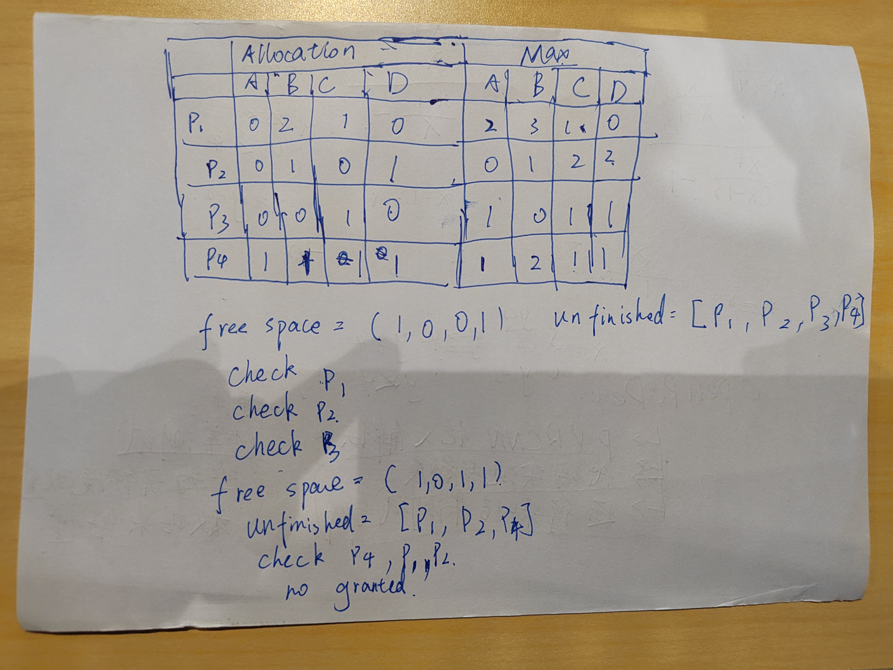

# Week12-Assignment-report

* 11911609 葛兆宁

## Q1

(1)

* Yes,it is.

* because use the banker's algorithm, we'll find out that the it can support the max need of the processes.

(2)



(3)

* P1: yes, because the required resource A and B is not enough.

* P2: yes, beacuse the required resource is not enough.

* P3: no.

* P4: yes, because the required resource is not enough.

## Q2

* design ideas1: before eating, they should check whether the fork_left and right is available, if available, eating, else put down the fork in  hand and go sleeping.

* code1:

```code
int fork_see[5];
void init() {
    for(int i=0;i<5;i++)
    {
        fork_see[i]=0;
    }
}

void wants_to_eat(int p_no) {
    // fixme
    
    pick_right_fork(p_no);
    __sync_fetch_and_add(&fork_see[right_fork_no(p_no)], 1);
    while(fork_see[p_no]>0)
    {
        put_right_fork(p_no);
        __sync_fetch_and_add(&fork_see[right_fork_no(p_no)], -1);
        __sync_fetch_and_add(&pick_cnt, -1);
        usleep(1000);
        pick_right_fork(p_no);
        __sync_fetch_and_add(&fork_see[right_fork_no(p_no)], 1);
    }
    pick_left_fork(p_no);
    __sync_fetch_and_add(&fork_see[p_no], 1);
    eat(p_no);

    put_left_fork(p_no);
    __sync_fetch_and_add(&fork_see[p_no], -1);
    put_right_fork(p_no);
    __sync_fetch_and_add(&fork_see[right_fork_no(p_no)], -1);
}

```

* result1:

```result1
11911609JohnnyGe@johnny-Ge-WXX9:~/OS/assignments/week12$ gcc phy1.c -pthread
11911609JohnnyGe@johnny-Ge-WXX9:~/OS/assignments/week12$ ./a.out 
[----------------------------------------------------------------------------------------------------] 100% done ok.
```

* design idea2: only one person can eat, the others wait until he finished.

* code2:

```code2
pthread_mutex_t lock;
void init()
{
    
}

void wants_to_eat(int p_no)
{
    // fixme
    pthread_mutex_lock(&lock);
    
    pick_right_fork(p_no);
    pick_left_fork(p_no);

    eat(p_no);

    put_left_fork(p_no);
    put_right_fork(p_no);
    pthread_mutex_unlock(&lock);
}

```

* result2:

```result2
11911609JohnnyGe@johnny-Ge-WXX9:~/OS/assignments/week12$ gcc phy2.c -pthread
11911609JohnnyGe@johnny-Ge-WXX9:~/OS/assignments/week12$ ./a.out 
[----------------------------------------------------------------------------------------------------] 100% done ok.
```

## Q3

* design idea: use semaphore sonlock to control the son, use semaphore parentlock to control the parent.

* code:

```code3
#include <stdio.h>
#include <stdlib.h>
#include <time.h> 
#include <pthread.h>
#include <semaphore.h>


pthread_mutex_t fri_lock;
sem_t sonlock;
sem_t parent_lock;
void *mom(int *num){
    for(int i=0;i<10;i++){
        sem_wait(&parent_lock);
        // pthread_mutex_lock(&fri_lock);
        printf("Mom comes home.\n");
        sleep(rand()%2+1);
        printf("Mom goes to buy milk.\n");
        *num += 1;
        if (*num > 2){
            printf("What a waste of food! The fridge can not hold so much milk!\n");
            while(1)printf("TAT~");
        }
        printf("Mom puts milk in fridge and leaves.\n");
        // pthread_mutex_unlock(&fri_lock);
        sem_post(&sonlock);
    }
    
}

void *dad(int *num){
    for(int i=0;i<10;i++){
        sem_wait(&parent_lock);
        // pthread_mutex_lock(&fri_lock);
        printf("Dad comes home.\n");
        sleep(rand()%2+1);
        printf("Dad goes to buy milk.\n");
        *num += 1;
        if (*num > 2){
            printf("What a waste of food! The fridge can not hold so much milk!\n");
            while(1)printf("TAT~");
        }
        printf("Dad puts milk in fridge and leaves.\n");  
        // pthread_mutex_unlock(&fri_lock);
        sem_post(&sonlock);
    }
    
}

void *grandfather(int *num){
    
    for(int i=0;i<10;i++){
        sem_wait(&parent_lock);
        // pthread_mutex_lock(&fri_lock);
        printf("Grandfather comes home.\n");
        sleep(rand()%2+1);
        printf("Grandfather goes to buy milk.\n");
        *num += 1;
        if (*num > 2){
            printf("What a waste of food! The fridge can not hold so much milk!\n");
            while(1){
             printf("TAT~");
            }
        }
        printf("Grandfather puts milk in fridge and leaves.\n");
        // pthread_mutex_unlock(&fri_lock);
        sem_post(&sonlock);
    }
    
}

void *son(int *num){
    for(int i = 0; i < 30 ; i++){
        sem_wait(&sonlock);
        pthread_mutex_lock(&fri_lock);
        printf("Son comes home.\n");
        if(*num == 0){
            printf("The fridge is empty!\n");
            while(1){
             printf("TAT~");
            }
        }
        printf("Son fetches a milk\n");
        *num -= 1;
        printf("Son leaves\n");
        pthread_mutex_unlock(&fri_lock);
        sem_post(&parent_lock);
    }
    
}

int main(int argc, char * argv[]) {
    srand(time(0));

    sem_init(&sonlock,0,0);
    sem_init(&parent_lock,0,2);

    int num_milk = 0;
    pthread_t p1, p2, p3, p4;
    pthread_mutex_init(&fri_lock,NULL);

    // Create two threads (both run func)  
    pthread_create(&p1, NULL, mom, &num_milk); 
    pthread_create(&p2, NULL, dad, &num_milk); 
    pthread_create(&p3, NULL, grandfather, &num_milk); 
    pthread_create(&p4, NULL, son, &num_milk); 
  
    // Wait for the threads to end. 
    pthread_join(p1, NULL); 
    pthread_join(p2, NULL); 
    pthread_join(p3, NULL); 
    pthread_join(p4, NULL); 

    printf("success!\n");
}

```

* result3:

```result3
11911609JohnnyGe@johnny-Ge-WXX9:~/OS/assignments/week12$ make milk
gcc -o milk milk.c -lpthread && ./milk
milk.c: In function ‘mom’:
milk.c:16:9: warning: implicit declaration of function ‘sleep’ [-Wimplicit-function-declaration]
   16 |         sleep(rand()%2+1);
      |         ^~~~~
milk.c: In function ‘main’:
milk.c:102:31: warning: passing argument 3 of ‘pthread_create’ from incompatible pointer type [-Wincompatible-pointer-types]
  102 |     pthread_create(&p1, NULL, mom, &num_milk);
      |                               ^~~
      |                               |
      |                               void * (*)(int *)
In file included from milk.c:4:
/usr/include/pthread.h:200:15: note: expected ‘void * (*)(void *)’ but argument is of type ‘void * (*)(int *)’
  200 |       void *(*__start_routine) (void *),
      |       ~~~~~~~~^~~~~~~~~~~~~~~~~~~~~~~~~
milk.c:103:31: warning: passing argument 3 of ‘pthread_create’ from incompatible pointer type [-Wincompatible-pointer-types]
  103 |     pthread_create(&p2, NULL, dad, &num_milk);
      |                               ^~~
      |                               |
      |                               void * (*)(int *)
In file included from milk.c:4:
/usr/include/pthread.h:200:15: note: expected ‘void * (*)(void *)’ but argument is of type ‘void * (*)(int *)’
  200 |       void *(*__start_routine) (void *),
      |       ~~~~~~~~^~~~~~~~~~~~~~~~~~~~~~~~~
milk.c:104:31: warning: passing argument 3 of ‘pthread_create’ from incompatible pointer type [-Wincompatible-pointer-types]
  104 |     pthread_create(&p3, NULL, grandfather, &num_milk);
      |                               ^~~~~~~~~~~
      |                               |
      |                               void * (*)(int *)
In file included from milk.c:4:
/usr/include/pthread.h:200:15: note: expected ‘void * (*)(void *)’ but argument is of type ‘void * (*)(int *)’
  200 |       void *(*__start_routine) (void *),
      |       ~~~~~~~~^~~~~~~~~~~~~~~~~~~~~~~~~
milk.c:105:31: warning: passing argument 3 of ‘pthread_create’ from incompatible pointer type [-Wincompatible-pointer-types]
  105 |     pthread_create(&p4, NULL, son, &num_milk);
      |                               ^~~
      |                               |
      |                               void * (*)(int *)
In file included from milk.c:4:
/usr/include/pthread.h:200:15: note: expected ‘void * (*)(void *)’ but argument is of type ‘void * (*)(int *)’
  200 |       void *(*__start_routine) (void *),
      |       ~~~~~~~~^~~~~~~~~~~~~~~~~~~~~~~~~
Mom comes home.
Dad comes home.
Mom goes to buy milk.
Mom puts milk in fridge and leaves.
Dad goes to buy milk.
Dad puts milk in fridge and leaves.
Son comes home.
Son fetches a milk
Son leaves
Son comes home.
Son fetches a milk
Son leaves
Grandfather comes home.
Mom comes home.
Grandfather goes to buy milk.
Grandfather puts milk in fridge and leaves.
Mom goes to buy milk.
Mom puts milk in fridge and leaves.
Son comes home.
Son fetches a milk
Son leaves
Son comes home.
Son fetches a milk
Son leaves
Dad comes home.
Grandfather comes home.
Grandfather goes to buy milk.
Grandfather puts milk in fridge and leaves.
Son comes home.
Son fetches a milk
Son leaves
Mom comes home.
Dad goes to buy milk.
Dad puts milk in fridge and leaves.
Son comes home.
Son fetches a milk
Son leaves
Grandfather comes home.
Mom goes to buy milk.
Mom puts milk in fridge and leaves.
Son comes home.
Son fetches a milk
Son leaves
Dad comes home.
Grandfather goes to buy milk.
Grandfather puts milk in fridge and leaves.
Son comes home.
Son fetches a milk
Son leaves
Mom comes home.
Dad goes to buy milk.
Dad puts milk in fridge and leaves.
Son comes home.
Son fetches a milk
Son leaves
Grandfather comes home.
Mom goes to buy milk.
Mom puts milk in fridge and leaves.
Son comes home.
Son fetches a milk
Son leaves
Dad comes home.
Grandfather goes to buy milk.
Grandfather puts milk in fridge and leaves.
Dad goes to buy milk.
Dad puts milk in fridge and leaves.
Son comes home.
Son fetches a milk
Son leaves
Son comes home.
Son fetches a milk
Son leaves
Grandfather comes home.
Mom comes home.
Mom goes to buy milk.
Mom puts milk in fridge and leaves.
Son comes home.
Son fetches a milk
Son leaves
Dad comes home.
Grandfather goes to buy milk.
Grandfather puts milk in fridge and leaves.
Son comes home.
Son fetches a milk
Son leaves
Mom comes home.
Dad goes to buy milk.
Dad puts milk in fridge and leaves.
Son comes home.
Son fetches a milk
Son leaves
Grandfather comes home.
Mom goes to buy milk.
Mom puts milk in fridge and leaves.
Son comes home.
Son fetches a milk
Son leaves
Grandfather goes to buy milk.
Grandfather puts milk in fridge and leaves.
Dad comes home.
Son comes home.
Son fetches a milk
Son leaves
Mom comes home.
Mom goes to buy milk.
Mom puts milk in fridge and leaves.
Dad goes to buy milk.
Dad puts milk in fridge and leaves.
Son comes home.
Son fetches a milk
Son leaves
Son comes home.
Son fetches a milk
Son leaves
Grandfather comes home.
Mom comes home.
Grandfather goes to buy milk.
Grandfather puts milk in fridge and leaves.
Son comes home.
Son fetches a milk
Son leaves
Dad comes home.
Mom goes to buy milk.
Mom puts milk in fridge and leaves.
Son comes home.
Son fetches a milk
Son leaves
Grandfather comes home.
Dad goes to buy milk.
Dad puts milk in fridge and leaves.
Son comes home.
Son fetches a milk
Son leaves
Mom comes home.
Grandfather goes to buy milk.
Grandfather puts milk in fridge and leaves.
Son comes home.
Son fetches a milk
Son leaves
Dad comes home.
Mom goes to buy milk.
Mom puts milk in fridge and leaves.
Dad goes to buy milk.
Dad puts milk in fridge and leaves.
Son comes home.
Son fetches a milk
Son leaves
Son comes home.
Son fetches a milk
Son leaves
Grandfather comes home.
Mom comes home.
Mom goes to buy milk.
Mom puts milk in fridge and leaves.
Son comes home.
Son fetches a milk
Son leaves
Dad comes home.
Grandfather goes to buy milk.
Grandfather puts milk in fridge and leaves.
Son comes home.
Son fetches a milk
Son leaves
Grandfather comes home.
Dad goes to buy milk.
Dad puts milk in fridge and leaves.
Grandfather goes to buy milk.
Grandfather puts milk in fridge and leaves.
Son comes home.
Son fetches a milk
Son leaves
Son comes home.
Son fetches a milk
Son leaves
Dad comes home.
Dad goes to buy milk.
Dad puts milk in fridge and leaves.
Son comes home.
Son fetches a milk
Son leaves
success!
11911609JohnnyGe@johnny-Ge-WXX9:~/OS/assignments/week12$ 
```
