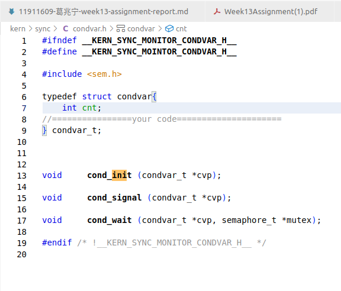
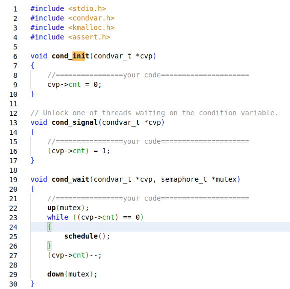
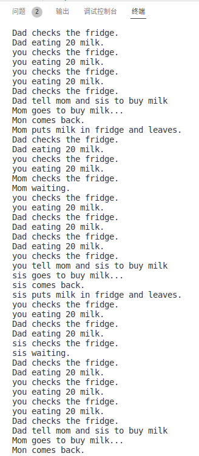
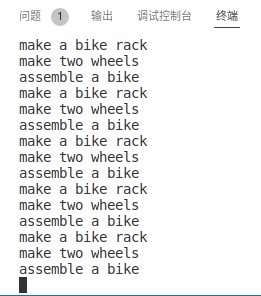

# Week13-Report

## 11911609-葛兆宁

## Q1

(1)

* polling:

  * pros: it is simple and working

  * cons:inefficiency on using the CPU

* Interrupt-based I/O

  * pros: can utilized the CPU more efficiently.

  * cons: need to context switch frequently which may cost more time than waiting.

(2)

* PIO: the CPU is involved in the data transfers.

* DMA: the CPU is not involved in the data transfer, but the DMA engine handles it

(3)

* explicit I/O instructions: those instructions are always privileged that only OS can use it, this protect the I/O from the abused by the malicious processes.

* memory-mapped I/O: it need OS load or store an address, so only with OS-granted process can use the I/O

## Q2

* Design ideas: Use only an integer to judge whether the thread should switch to the other thread(process, because I check that the test still use the process structure).

* code:
  * condvar.h:  
  
  
  * condvar.c:  
  

* result:  


## Q3

* Design ideas: use the conditional varible to decide the order, use mutex to lock the thread.

* code:  
  * check_exercise.c:  
  
  ```code3
    // kern/sync/check_exercise.c

    # include <stdio.h>
    # include <proc.h>
    # include <sem.h>
    # include <assert.h>
    # include <condvar.h>

    struct proc_struct *pworker1,*pworker2,*pworker3;
    semaphore_t mutex;
    condvar_t cvp[2];

    void worker1(int i)
    {
        while (1)
        {
            down(&mutex);
            cprintf("make a bike rack\n");
            cond_signal(&cvp[0]);
            up(&mutex);
           do_sleep(10);
        }
    }

    void worker2(int i)
    {
        while (1)
        {
            down(&mutex);
            cond_wait(&cvp[0],&mutex);
            cprintf("make two wheels\n");
            cond_signal(&cvp[1]);
            up(&mutex);
            do_sleep(10);
        }
    }

    void worker3(int i)
    {
        while (1)
        {
            down(&mutex);
            cond_wait(&cvp[1],&mutex);
            cprintf("assemble a bike\n");
            up(&mutex);
            do_sleep(10);
        }
    }

    void check_exercise(void){

         //initial
 
        for(int i=0;i<2;i++)
        {
            cond_init(&cvp[i]);
        }
        sem_init(&mutex,1);
        int pids[3];
        int i =0;
        pids[0]=kernel_thread(worker1, (void *)i, 0);
        pids[1]=kernel_thread(worker2, (void *)i, 0);
        pids[2]=kernel_thread(worker3, (void *)i, 0);
        pworker1 = find_proc(pids[0]);
        set_proc_name(pworker1, "worker1");
        pworker2 = find_proc(pids[1]);
        set_proc_name(pworker2, "worker2");
        pworker3 = find_proc(pids[2]);
        set_proc_name(pworker3, "worker3");
    }

  ```

* result:  
  
